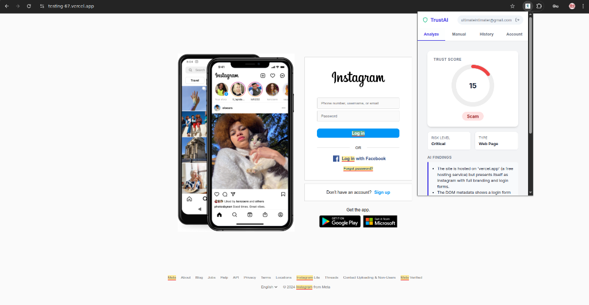

# TrustAI Chrome Extension

  

## Overview

TrustAI checks whether the website you are visiting is safe. Unlike standard filters that only check blocklists, this extension analyzes the actual content, news claims, and visual context of the page in real-time. It can detect if a site is pretending to be a major brand or if an article contains unverified fake news.

**Current Status**: Beta (Manual Installation required).

## Features

-   **Deep Content Analysis**: Checks page text and structure for social engineering tactics.
-   **Visual Verification**: Uses OCR to read text from images/screenshots to find hidden threats.
-   **Fake News Detector**: Cross-references claims against trusted sources to identify misinformation and fake news articles.
-   **Trust Score**: Gives a simple 0-100 score based on risk factors.
-   **Detailed Reports**: Tells you exactly *why* a page is flagged (e.g., "Login form detected on a free hosting subdomain").

## Try the Demo

I've created a harmless "phishing simulation" page to demonstrate how the detection works. You can target this page to see the extension in action.

**Demo URL**: [https://testing-67.vercel.app/](https://testing-67.vercel.app/)

**How to test:**
1.  Install the extension (instructions below).
2.  Navigate to the [Demo URL](https://testing-67.vercel.app/).
3.  Open TrustAI and click **Analyze**.
4.  The extension will flag the page as a **Scam**.
    -   *Why?* It detects an Instagram login form, but sees that the domain is `vercel.app` instead of `instagram.com`. It will also highlight specific suspicious text blocks.

## Installation (Developer Mode)

1.  **Get the Code**: Clone this repo or download the `trustai-extension` folder.
2.  **Open Extensions**: Go to `chrome://extensions/` in Chrome.
3.  **Enable Developer Mode**: Switch the toggle in the top-right corner.
4.  **Load Unpacked**: Click the button and select the `trustai-extension` folder.
5.  **Pin it**: Pin the extension to your toolbar for easy access.

## Tech Stack

-   **Frontend**: React, TailwindCSS
-   **Backend**: Django, Python
-   **AI**: DeepSeek V3 (Reasoning)
